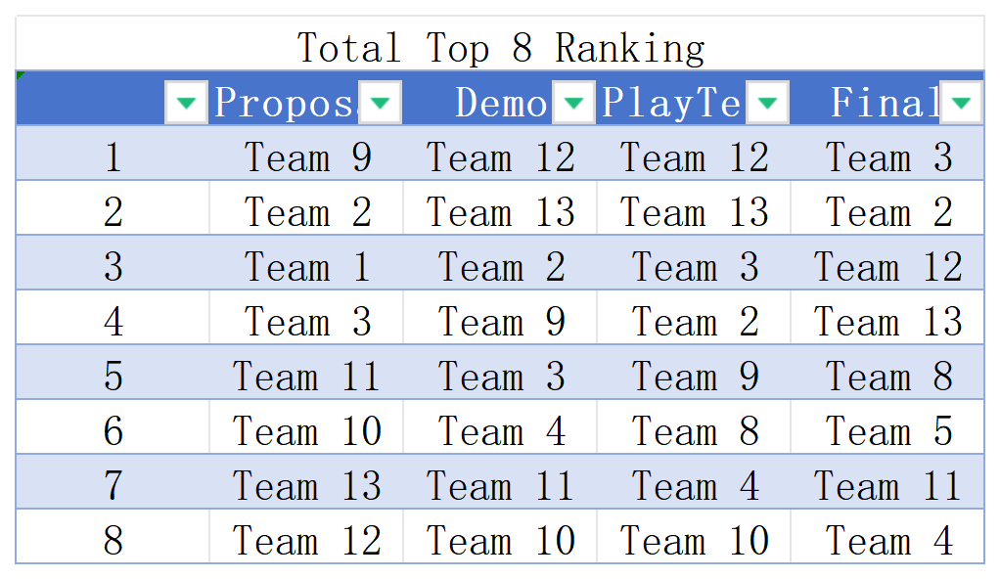
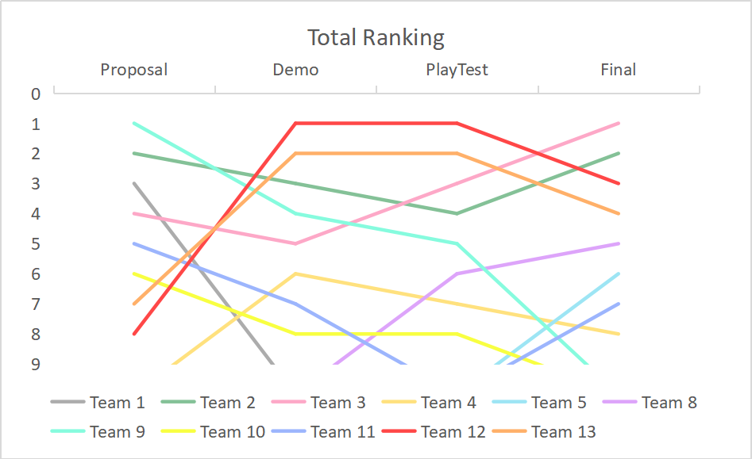

# 沉浸式2D游戏开发体验
## 游戏开发课程简介
- 授课教师：[Kelvin Sung (宋賢清)](https://faculty.washington.edu/ksung/)
- 授课对象：西安交通大学计算机科学与技术试验班21、22级全体学生
- 开课时间：20240318 - 20240328（集训式课程）
- 课程主页：[XJTU-IntroGameDev](https://myuwbclasses.github.io/XJTU-IntroGameDev/)

## 我的团队
- 我的团队：[Null Reference Master](https://github.com/NullRefMaster)
- 团队编号：Team 2
- 团队成员
    - [Mingzhuo Yin](https://github.com/silver-ymz)
    - [Chris Yang](https://github.com/yy4382)
    - [Boxuan Hu](https://github.com/root-hbx)
    - [Yuhao Wang](https://github.com/wyhlele)
    - [Xuande Mi](https://github.com/orgs/NullRefMaster/people/XuandeMi)
    - [Keshuo Xing](https://github.com/SampleTree123)

## 我们的成果
- [项目仓库](https://github.com/NullRefMaster/Suicide)
- [网址发布](https://nullrefmaster.github.io/Suicide/)

## 我们的ranking
We are __Team 2__!

## 项目习得
1. 从零开始构建一个项目难度很大，需要熟练运用版本控制系统，以实现多成员协作，高效率开发；
2. 代码规范与风格非常重要，还需要根据不同语言变通；
3. 面向对象编程真的真的很重要；
3. 设计整个工程的运行与调用逻辑十分重要，函数封装与抽象更是重中之重；
4. 作为一名有志于成为优秀程序员的CS专业学生，应当在日常学习中投入一部分时间给前后端开发
......

## 课程感受
1. Prof.Sung 作为国际计算机知名教授，水平极高，且平易近人，是一位我极其敬佩的教授
2. 课程质量极高，且互动感强。开设课程的10天里，我基本可以做到上课不看手机不看表
3. 课程考核与作业设计很符合我对国外计算机课程的预期，根据项目实战的结果进行打分，避免不必要的“内卷”
4. 课后安排office hour，这点特别好！不管我们问的问题有多简单，老师都会随时、耐心地答疑
5. 我很震惊于Prof.Sung会在每一组汇报的过程中记录近一页纸的笔记，随后根据记录内容进行提问与答疑
6. 陪我Debug的老师百里挑一🥹
7. 一步步指引我Debug的老师千里挑一😭
8. 牺牲课余时间帮我Debug的老师万里挑一👏（调完bug之后还夸我，说我遇见的这个问题十分隐蔽，记得提醒他次日上课时说明一下）
9. 原来真的能在10天内对unity从零开始学习，直到实现一个小项目
10. 英语课堂处处洋溢着活力，这是一个绝佳的沉浸式体验国外高质量计算机课程的机会！

## 开发感受
1. 原来“古希腊掌管计算机的神”就在我身边，有些“神”的战斗力真的可以单杀一整支队伍
2. 我对于代码规范的理解又上升了一个层次，有时候“神”写的源码可以给我很多规范性上的启示
3. 在从事这个项目的开发中，我第一次意识到面向对象编程的重要性，如何构建、如何封装、如何调用、如何支配权限等问题是开发者设计代码过程中的重点
4. 分划调用与函数的抽象逻辑真的是函数之“魂”，有时候看“神”构建代码的过程能够给我很多工程设计上的启迪
5. 团队协作真的很重要，有大神负责整个工程的抽象构建，有一众小神负责不同组分的实现，开发效率高
6. 要多和团队成员交流，针对同一个问题，交流后会收获很多，既有利于该项目的完善，也有利于日后工程开发的经验积累
7. 要学会倾听他人的意见，根据不同的玩家建议，不断修复改进项目设计，增进项目体验感

## 致谢环节
- 首先要感谢 Prof.Sung 精心的课程设计，他为我们沉浸式体验2D游戏开发投入了很多
- 其次要感谢计算机学院的大力支持，引入国际化课堂拓展学生的视野，尤其感谢唐老师为整个计试创设的良好coding氛围，他为我们的师资配备倾注了相当多精力
- 最后要感谢我的队友，在这短短的10天里，我们保持着日均4h的睡眠时间，在项目开发的过程中习得了许多，也在很多方面作出了改善，是我们共同的努力实现了这个项目！

2024 0329 凌晨 02:47