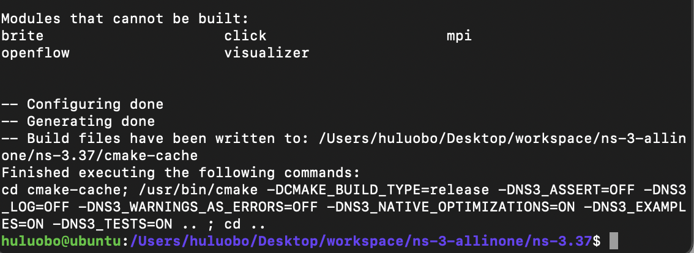
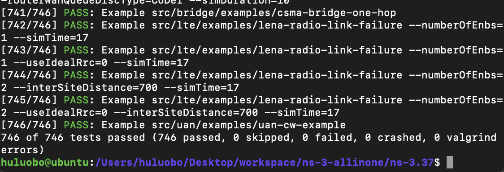
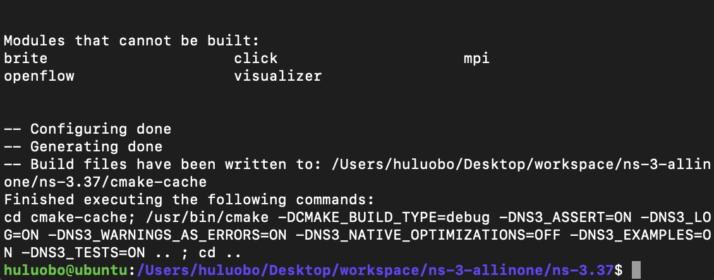

# ns-3 环境配置

>made by XJTU  CS2201(H) 胡博瑄

#### 0. ns3简介

ns-3是一个开源的网络仿真器，用于网络通信系统和协议的建模与仿真。如果你准备参与计算机网络和云计算方面的科研项目，它将是你忠诚而可靠的“另一半”。它被广泛应用于研究、开发和测试各种网络技术和算法。

ns-3被构建为一组相互协作的软件库，用户可以编写C++或Python编程语言的程序，并与这些库进行链接或导入。

#### 1. 本文电脑配置环境与目标版本：
1. 电脑：Macbook Pro（M2）
2. 配置环境：Linux虚拟机（Ubuntu 22.04LTS）
3. 目标版本：ns-3.37

#### 2. 以下工具是开始使用ns-3所需的：
>C++编译器 clang++或（g++版本9或更高）g++
Python python3版本>=3.6
CMake cmake版本>=3.10 构建系统 make
ninja（XCode）或xcodebuild
Git 任何最新版本（用于从GitLab.com访问ns-3）
tar 任何最新版本（用于解压ns-3发布）
bunzip2 任何最新版本（用于解压缩ns-3发布）

```unix
sudo apt install g++ python3 cmake ninja-build git
sudo apt install ccache
sudo apt install python3-pip
python3 -m pip install --user cppyy // 待定，目前看来并不是必需品，因为我没配上却也不影响使用🤡
sudo apt install gir1.2-goocanvas-2.0 python3-gi python3-gi-cairo python3-pygraphviz gir1.2-gtk-3.0 ipython3
sudo apt install python3-setuptools git
sudo apt install qtbase5-dev qtchooser qt5-qmake qtbase5-dev-tools
sudo apt install openmpi-bin openmpi-common openmpi-doc libopenmpi-dev
sudo apt install mercurial unzip
sudo apt install gdb valgrind
sudo apt install clang-format
sudo apt install doxygen graphviz imagemagick
sudo apt install texlive texlive-extra-utils texlive-latex-extra texlive-font-utils dvipng latexmk
sudo apt install python3-sphinx dia
sudo apt install gsl-bin libgsl-dev libgslcblas0
sudo apt install tcpdump
sudo apt install sqlite sqlite3 libsqlite3-dev // 如果出问题可以改成：sudo apt install sqlite3 libsqlite3-dev
sudo apt install libxml2 libxml2-dev
sudo apt install libgtk-3-dev
sudo apt install vtun lxc uml-utilities
sudo apt install libxml2 libxml2-dev libboost-all-dev
```
#### 3. 使用Git安装ns3：
> ps: 要是不熟悉git，说明你的科研经历存在跳步，建议复习基础运维知识

```unix
(1) 建立文件夹，在文件夹中放置安装包：
cd //随便你建立在哪里，我的选择是: cd /Desktop/
mkdir workspace

(2) 进入文件夹，进行clone：
cd workspace
git clone https://gitlab.com/nsnam/ns-3-allinone.git
cd ns-3-allinone
```

#### 4. 进入指定的ns-3-allinone进行后续配置：

==在文件夹ns-3-allinone下==对指定的ns3版本进行下载：(看文件配置和我的截图时，记得仔细看配置的路径！)
```unix
python3 download.py -n ns-3.37
```


#### 5. 用CMake包装器进行构建：
>ps：需要注意的是，新版本的ns3（3.36后续版本）已经不再使用waf工具进行项目的构建了

1. 紧随上面的内容，**进入ns-3.37文件夹**：
2. 为实现用户界面，这里包含名为ns-3的CMake包装器脚本。（你在这一步啥也不用做，直接看下面就行）
3. 为了告诉ns-3进行包含示例和测试的优化构建，执行以下命令：
```unix
./ns3 clean
./ns3 configure --build-profile=optimized --enable-examples --enable-tests
```
4. 现在你可以看到它的反馈，说明构建成功✅

#### 6. 手动进行ns-3模块测试：
**这一步依然是在ns-3.37文件夹下进行**
```unix
./test.py
```

这会经历一个漫长的过程，形如：


最后，看到这样的界面，说明搭建测试成功：


#### 7. 自行检测是否安装成功：
通常我们==在 ns3 的控制下运行脚本==。这样可以确保构建系统正确设置了共享库路径，并且在运行时库是可用的。

要运行一个程序，只需在 ns3 中使用 `--run` 选项。我们来运行 ns-3 中类似于传统的 "Hello World" 程序，输入以下命令：
```bash
$ ./ns3 run hello-simulator
```

ns3 会首先检查程序是否已正确构建，如果需要的话会执行构建。然后，ns3 执行该程序，产生以下输出：
``` shell
Hello Simulator
Congratulations! You are now an ns-3 user!
```
##### ps：如果你没有看到输出怎么办？
如果你看到 ns3 的消息表明构建成功，但是没有看到 "Hello Simulator" 的输出，**很可能是你已经在 "Building with the ns3 CMake wrapper" 部分将构建模式切换为了优化模式，但是忘记了切回调试模式**。在本教程中使用了一个特殊的 ns-3 日志组件来打印用户消息到控制台。在编译优化代码时，此组件的输出会自动禁用，即被“优化掉”。如果你没有看到 "Hello Simulator" 输出，请输入以下命令：

```bash
$ ./ns3 configure --build-profile=debug --enable-examples --enable-tests
```

这告诉 ns3 构建调试版本的 ns-3 程序，包括示例和测试。


然后，你仍然需要构建实际的调试版本代码，输入以下命令：

```bash
$ ./ns3
```

这会经历一个漫长的过程，直到全部搭建完成：


现在，如果运行 `hello-simulator` 程序，你应该能看到预期的输出:


#### 8. 结语：
1. 恭喜你，到了这里你就已经配置成功了！
2. 不要忘了本文的配置顺序是渐进的，如果你留心的话会发现：./test.py之后跳出的部分显示之前配置的是**优化模式**；而后续./ns3 configure --build-profile=debug --enable-examples --enable-tests对应配置的是**调试模式**。在我们的日常科研中用到的基本是调试模式！