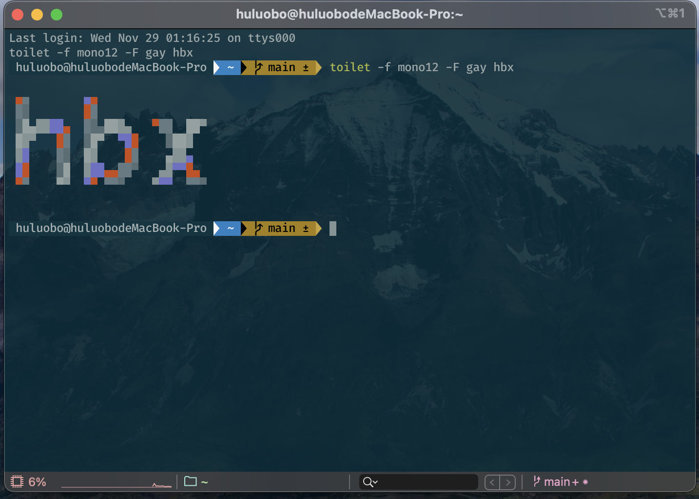

# oh-my-zsh配置

> made by XJTU CS2201(H) 胡博瑄

## 0. 前置介绍
- 使用设备：MacbookPro(M2)
- 电脑版本：Sonoma 14.0 (23A344)
- 配置目的：我的mac默认终端是zsh，但缺乏oh-my-zsh的加持，它显得不够高端🤡，于是我决定“升级”！

直接从官网下载iTerm.app软件：[https://iterm2.com/](https://iterm2.com/)

## 1. 安装oh-my-zsh

```text
sh -c "$(curl -fsSL https://raw.github.com/robbyrussell/oh-my-zsh/master/tools/install.sh)"
```

当然，你也可以使用 git clone 进行下载，两者是一个意思，此处略去

## 2. 设置zsh主题

```text
open ~/.zshrc

```

```text
source ~/.zshrc

```

## 3. 安装并设置FiraCode字体

安装字体：

```text
brew tap homebrew/cask-fonts
brew install font-fira-code --cask
```

设置字体：


## 4. 安装并设置配色（随意，这里以snazzy举例）

1. 安装配色：下载后点击：Add it anyway

2. 设置配色：


## 5. 安装几个插件

### （1）自定义zsh提示符和色彩的插件：pure prompt
#### 我认为的fastest方法:
```text
brew install pure
# .zshrc
autoload -U promptinit; promptinit
prompt pure
```

### （2）模糊查找fuzzy finder
```text
git clone --depth 1 https://github.com/junegunn/fzf.git ~/.fzf
~/.fzf/install
```

很显然：一路y就好

使用快捷键：`ctrl+R`

## ⚠️下面这三个先下载后配置！

### （3）语法高亮：zsh-syntax-highlighting（下载a）

```text
git clone https://github.com/zsh-users/zsh-syntax-highlighting.git ${ZSH_CUSTOM:-~/.oh-my-zsh/custom}/plugins/zsh-syntax-highlighting
```

### （4）自动补全：zsh-autosuggestions（下载b）

```text
 git clone https://github.com/zsh-users/zsh-autosuggestions ~/.oh-my-zsh/custom/plugins/zsh-autosuggestions
```

### （5）自动到达路径：autojump（下载c）

```text
brew install autojump
```

### （6） 配置环境变量（对应上述的：下载a/b/c）
```text
open ~/.zshrc
```

```text
plugins=(
  git
  zsh-syntax-highlighting
  zsh-autosuggestions
  autojump
)

```

**这里注意，必须是小写**

### （7） 随后source，让它起作用

```text
source ~/.zshrc

```

## 6. 其他设置

### Status Bar:


### 快速隐藏和显示窗体（我强烈推荐！非常酷炫！）：


### 设置自启动命令：

```text
brew install toilet
```

```text
toilet -f mono12 -F gay Hello  

// 这里的hello随你换，换成你喜欢的“问候语”就行，下面的图示中对应改一下即可
```


### 设置用户名颜色、设置用户名、设置显示时间：


### 给ITerm中Vim配色：


### 给ITerm2中ls配色：


## 7. 效果演示


#### 我的配置清单：
- 上面介绍的五款插件
- 自开启iterm2的快捷键：command+p
- 窗口默认显示长宽比：100:50
- 窗口显示透明度：10%
- 显示窗体（悬浮窗）：cpu使用率 + 内存使用率 + 当前git地址 + 查找


## 8. 附录：iTerm2 快捷命令
  - command + enter 进入与返回全屏模式
  - command + t 新建标签
  - command + w 关闭标签
  - command + 数字 command + 左右方向键    切换标签
  - command + enter 切换全屏
  - command + f 查找
  - command + d 水平分屏
  - command + shift + d 垂直分屏
  - command + option + 方向键 command + [ 或 command + ]    切换屏幕
  - command + ; 查看历史命令
  - command + shift + h 查看剪贴板历史
  - ctrl + u    清除当前行
  - ctrl + l    清屏
  - ctrl + a    到行首
  - ctrl + e    到行尾
  - ctrl + f/b  前进后退
  - ctrl + p    上一条命令
  - ctrl + r    搜索命令历史
-----

- 进入iterm
- cd 
- ls
- command + ; 查看历史命令
- command + shift + h 查看剪贴板历史
- command + shift + d 垂直分屏
- `Option+Cmd+B` 即可打开一个**进度条**，倒退到这个窗口之前的快照。**回放**¡
- j
- ctrl+r
- 再次新建