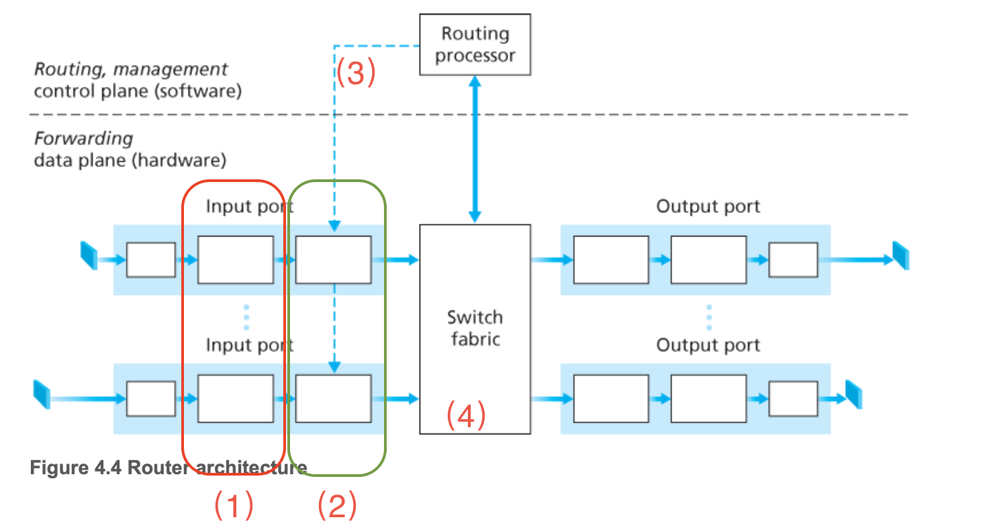

# Chapter4 网络层：数据平面

> 由于本人科研详做这方面，本章内容整理的较为“提纲挈领”，更多详细机制参见书本

### 1）引入
#### 基础：
- 在网络中的每一台主机和路由器中都有一个网络层部分，它能被分为两个互相作用的部分：数据平面 + 控制平面
- 数据平面功能：决定到达路由器输入链路之一的数据报（即：网络层中的分组）如何转发到该路由器的输出链路之一
- 控制平面功能：控制数据报沿着从*源主机*到*目的主机*的端到端路径的路由器之间的路由方式
- 软件定义网络(Software-Defined Network , SDN)：将这些控制平面的功能作为一种单独服务，明确地分离数据平面和控制平面
#### 概述：
##### （1）转发和路由选择
- 转发：当一个分组到达某路由器的一条输入链路时，该路由器必须将该分组移动到适当的输出链路【数据平面内的唯一功能】
- 路由选择：当分组从发送方流向接收方时，网络层必须决定这些分组所采用的路由or路径，计算这些路径的算法被称为“路由选择算法”(routing algorithm)【在控制平面内实现】

1. 转发（forwarding）
>是指：将一个分组从一个*输入链路接口* 转移到*适当的输出链路接口* 的==路由器本地操作==，耗时短，常采用硬件实现
2. 路由选择（routing）
>确定分组从源到目的地所采取的端到端路径的网络范围处理过程，时间尺度长，常采用软件形式
3. 每个网络路由器中都蕴含着一个关键元素：转发表(forwarding table)
>路由器检查到达分组首部的一个或多个字段值，进而==使用这些首部值在其转发表中索引(raise ques: 转发表如何配置？详见下文！)==，这些值对应着存储在转发表项中的值，指出了该分组将被转发的路由器的输出链路接口
##### （2）控制平面【传统方法】
- 上文引出了问题：转发表一开始是如何配置的？
- Ans：路由选择算法决定了插入该路由器转发表的内容
- 路由选择算法运行在每台路由器中，并且在每台路由器中都包含*转发* 和*路由选择* 两种功能
- 一台路由器中的路由选择算法和其他路由器的路由选择算法形成“communication”，以计算出它的转发表的值
- 这种“communication”建立在：路由器根据*路由选择协议* 交换包括路由选择信息的*路由选择报文*
##### （3）控制平面【SDN方法】
- 软件定义网络——SDN
- 控制平面的**路由选择功能与物理的路由器是分离的**，即：路由选择设备仅执行转发，而远程控制器计算并分发*转发表*
- 远程控制器可能实现在具有高可靠性和冗余的远程数据中心中，并可能由ISP或**第三方管理**
- 路由器与远程控制器之间的通信：通过交换包含转发表和其他路由选择信息的报文
##### （4）网络服务模型(network service model)
1. 定义了分组在发送和接收主机之间的**端到端**传输特性
2. 服务包含：
>[1] 确保交付
>[2] 具有时延上限的确保交付
>[3] 有序分组支付 
>[4] 确保最小带宽
>[5] 安全性

3. 互联网的网络层提供的是“尽力而为服务”(best-effort service)，上述服务不一定能有绝对的保障率，但是肯定会尽最大的力【虽然看上去很不靠谱，但是事实证明它已经“足够好”】
### 2）路由器工作原理

##### 1. 输入端口：
- （1）：与位于入链路远端的数据链路层交互，来执行数据链路层的功能
- （2）：在输入端口执行*查找* 功能，在这里通过查询转发表**决定路由器的输出端口**，到达的分组通过路由器交换结构转发到对应的输出端口
- （3）：控制分组(eg：携带路由选择协议信息的分组)从输入端口转发到“路由选择处理器”，进入“控制平面”
##### 2. 交换结构：
- 将路由器的输入端口连接到它的输出端口
- 某种意义上，它是网络路由器中的网络
##### 3. 输出端口：
- 【1】存储从接收交换结构接收的分组
- 【2】通过执行必要的链路与物理层功能实现：在输出链路上传输这些分组
- ps：当一条链路是双向的（即：承载两个方向上的流量）时，输出端口与输入端口成对出现在同一线路卡上
##### 4. 路由选择处理器：
- 执行控制平面的功能
- 在传统的路由器中：1. 执行路由选择协议；2. 维护路由信息表与关联链路状态信息；（3）为该路由器计算转发表
- 在SDN中：负责与远程控制器communicate，目的是接收由远程控制器计算的转发表项；并在输入端口安装这些表项
- 还会执行一些基本的“网络管理”功能

### 3）网际协议：IPv4、寻址、IPv6及其他
- [ ] IPv4的数据报格式：特别细节，此处略，详见原书
- [ ] IPv4编址：特别细节，此处略，详见原书
- [ ] 网络地址转换：网络地址转换机制(Network Address Translation，NAT)；NAT转换表
- [ ] IPv6的数据报格式：详见原书
- [ ] IPv4->IPv6的迁移过程：\[1] “标志日”；\[2] 建隧道(tunneling)机制：很神奇的“暗渡陈仓”机制🤣🤡

### 4）泛化转发与SDN
##### 1. 之前介绍的路由器是基于目的地转发：
- step1：查找目的IP地址("匹配")
- step2：将分组发送到有特定输出端口的交换结构("操作")
##### 2. 我们现在考虑“匹配+操作”的格式：
- 匹配与转发表called：流表（flow table）
- 流表：推广了之前提到的基于目的地的转发表的concept，由于转发策略可能使用网络层/链路层源地址与目标地址，因此此时的转发设备兼具了第二层“交换机”与第三层“路由器”的特性，我们今后统称它为“分组交换机”
- 每台分组交换机中有一张匹配与转发表(即：流表，flow table)，该表由远程控制器计算、安装、更新
#### 3. 匹配：

##### key！
- 源和目的MAC地址是与帧的发送和接收接口相关联的链路层地址
- 通过基于以太网地址而不是IP地址进行转发
- 很显然：此设备**等价于**路由器(layer3 device)转发数据报 + 交换机(layer2 device)转发帧 
##### general：
- 入端口是指分组交换机上接收分组的输入端口
- *流表项* 也可以有通配符：例如一个流表中的地址为128.119.\*，\*将匹配其地址的前16bit为128.119的任何数据报所对应的地址字段；
- 每个*流表项* 也具有相应的优先权，如果一个分组匹配多个流表项，选定的匹配和对应的操作将是**其中有最高优先权**的那个
#### 4. 操作：
每个流表项都有0个或多个操作列表，如有多个则按照在表中规定的次序执行
###### 1）转发：对于一个入分组而言
>[1] 转发到一个特定的物理输出端口
>[2] 广播到所有端口
>[3] 通过所选的端口集合进行多播
>[4] 该分组可能被封装并发送到该设备的远程控制器，该控制器may(also may not)对分组采取某些操作
###### 2）丢弃：
>没有操作的流表项表明某个匹配的分组应当被丢弃(discard)
###### 3）修改字段：
>在分组被转发到所选的输出端口之前，分组首部10个字段中的值可以重写